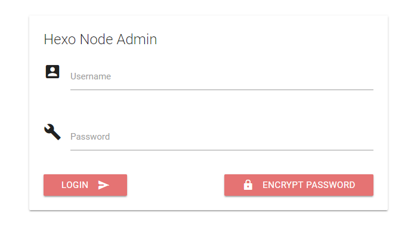
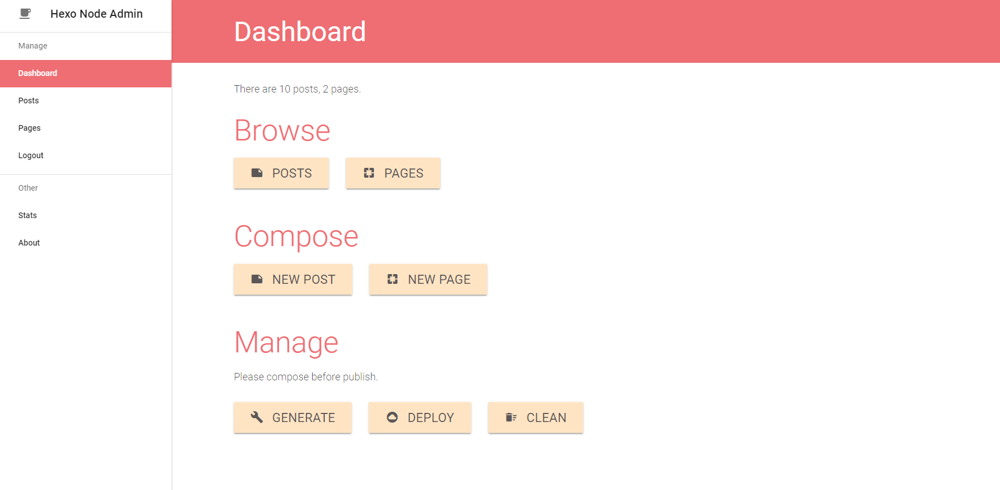
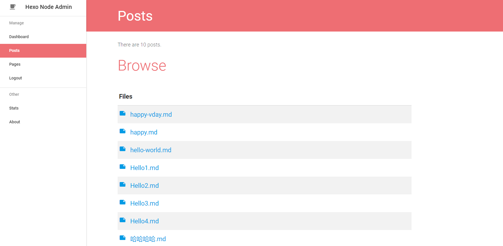
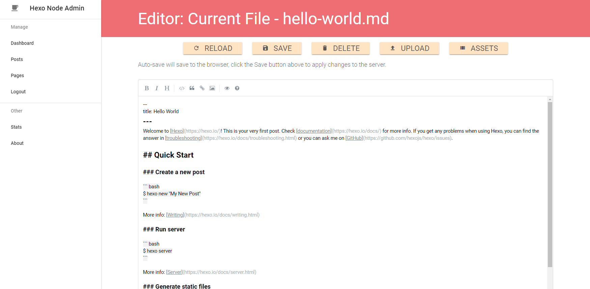
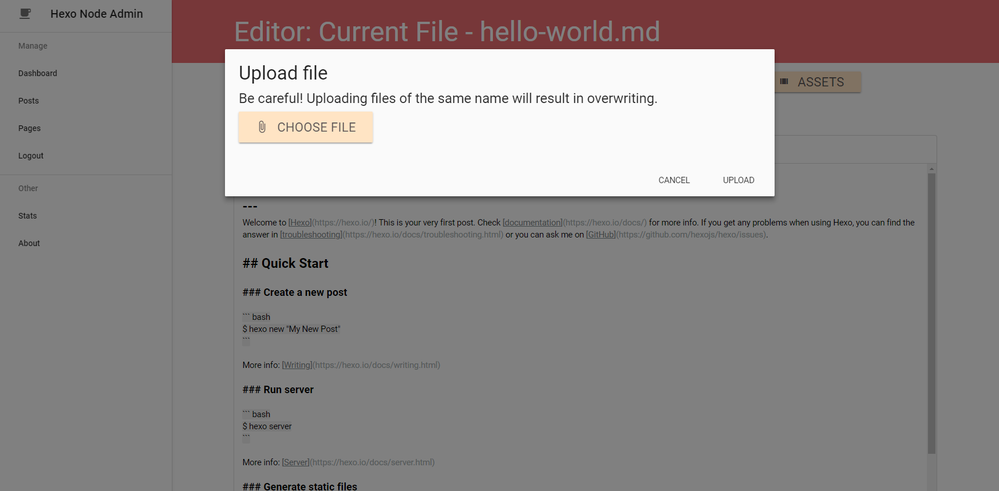
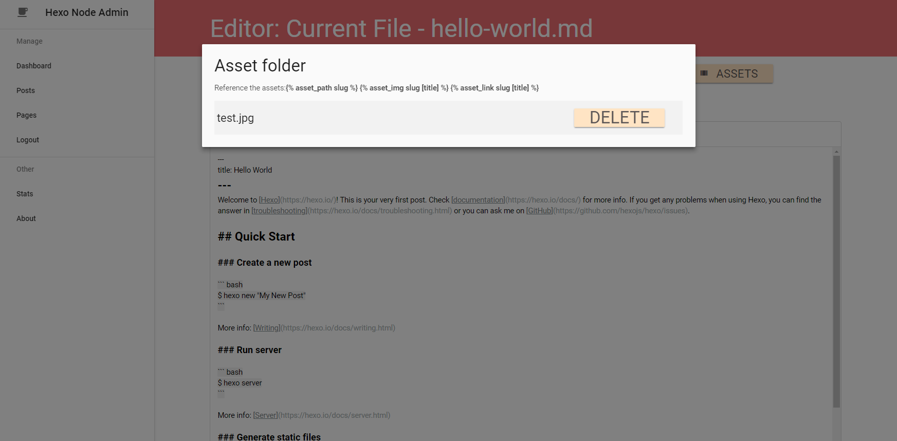

# Hexo Node Admin

A [Hexo](https://hexo.io/) management tool with UI designed to make it easier for you to compose, inspired by [hexo-admin](https://github.com/jaredly/hexo-admin).

## Hexo Version

Works with `3.x`, not sure if it works with `2.x` or `1.x`, you can give it a try :D.

## Features

- **Full** control over your Hexo workspace with **adding**, **editing**, ***deleting*** your posts and pages.
- Supports `post_asset_folder` setting of Hexo with **uploading**, **deleting**, **referencing** your corresponding assets like **images** and any other attachments.
- Supports **Hexo command** `hexo generate`, `hexo deploy` and `hexo clean`. You only need several clicks to get your things going.
- Using powerful markdown editor [SimpleMDE](https://simplemde.com/) with **Auto-saving** function.
- Supports **password authentication** for admin pages.
- Supports both Hexo default deploy settings and **custom shell scripts** (like executing some `cp` commands).
- Supports multiple languages. Currently supports `en_US` and `zh_CN` (简体中文), you can contribute to localization by editing language packs in `lang` folder.

## Browse

- [**Quickstart**](#quickstart)
- [**Screenshots**](#screenshots)
- [**Password**](#password)
- [**Auto-saving**](#auto-saving)
- [**Language**](#language)
- [**Assets**](#assets)
- [**Deploy**](#deploy)
- [**Contribute**](#contribute)
- [**Donate**](#donate)

**Make sure you have the permissions on the Hexo folder and files.**

**You'd better read through this README, especially about [Auto-saving](#auto-saving) to understand the behavior of the editor.**

## Quickstart

### 1. Clone this repository to wherever you like and enter it. (Or download as a zip file and unzip it into your hexo folder.)

```
git clone https://github.com/quincyyhuang/hexo-node-admin
cd hexo-node-admin
```

### 2. Install dependencies using NPM or Yarn

```
// NPM
npm install
// Yarn
yarn
```

### 3. Add your absolute path to hexo to `config.json`

```
{
    "port": 4001,
    "admin": {
        "username": "test",
        "password": "test",
        "plain": true
    },
    "hexo_dir": "/absolute/path/to/hexo",   // Change this to your ABSOLUTE PATH to hexo, leave it blank if it is the current folder.
    "deploy": {
        "type": "default",
        "script": ""
    },
    "lang": "en_US"
}
```

### 4. Go!

```
// Using NPM
npm start
// Using Yarn
yarn start
// Or just Node.js
node index.js
```

### 5. See what you got!

`open http://localhost:4001`, your default username is `test` and password is `test`. You can change them [later](#password).

## Why not a module?

Because `hexo-node-admin` is not actually a module or a Hexo plugin. It's more like a standalone backend that operates on Hexo resources.

## Screenshots









## Password

By default, your password is saved in plain text. To encrypt your password, follow the steps.

### 1. Navigate to the `Login` page. (Logout first if necessary.)

### 2. Click button `ENCRYPT PASSWORD`.

### 3. Type in your password and hit `Enter`.

### 4. Copy the result into your `config.json` file to field `password`.

### 5. Change the `plain` field to `false`.

### 6. Save the file and **restart** the server. Everything will do!

## Auto-saving

The markdown editor autosaves the content in it every 5 seconds to `localStorage` of your browser. **If you want to apply the change to server, please click button `Save`**.

**Notice!** The editor lazy-loads your posts and pages which means only if you click button `Reload`, it retrieves the file from server. Otherwise it displays what is stored in your browser(your latest editing version). In this case, you should **feel safe** to close the editor whenever you like without feeling unsure about your work.

## Language

Change the `lang` field in `config.json`. Default is `en_US`. Following languages are available.

- `en_US`
- `zh_CN` 简体中文

## Assets

Read [this](https://hexo.io/docs/asset-folders.html) about `post_asset_folder` before.

Change the `post_asset_folder` field to `true` in `_config.yml` of your Hexo will do.

**Notice!** New asset folder of the same name with your file will be created if there isn't one.

### Upload Asset

Upload is easy. Just click the button `Upload` and choose your file. It will be uploaded to the asset folder.



### Delete Asset

Delete is easy. Just click the button `Assets` to show your assets and click `Delete`.



### Reference Asset

You can read [this](https://hexo.io/docs/asset-folders.html#Tag-Plugins-For-Relative-Path-Referencing) on how to reference your assets in your files.

Basically:

```



```

## Deploy

`hexo-node-admin` supports 2 types of deploy, you can use both **default** Hexo deploy and **custom** shell script that can be executed on the server.

### 1. Hexo default deploy

Just define your deploy setting in `_config.yml` of your Hexo folder as suggested [here](https://hexo.io/docs/deployment.html). `hexo-node-admin` will execute `hexo deploy` command for you.

### 2. Custom shell script

Change the deploy type in `config.json` to `custom` and specify the `script` field.

**Notice!** The `script` field can either be **The Absolute Path of a shell file (`.sh` on Linux/Mac, `.cmd` or `.bat` on Windows)**, or **A single line of command like `cp -fr /path/to/hexo/public/* /webroot`**.

## Contribute

I sincerely welcome everyone to contribute to this project. Thanks a lot!

## Donate

If you like this project, feel free to donate! Appreciated!

### Alipay


### Paypal

Send money to `quincyyhuang@gmail.com`